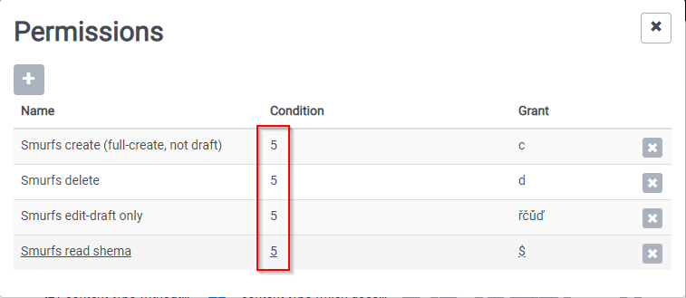
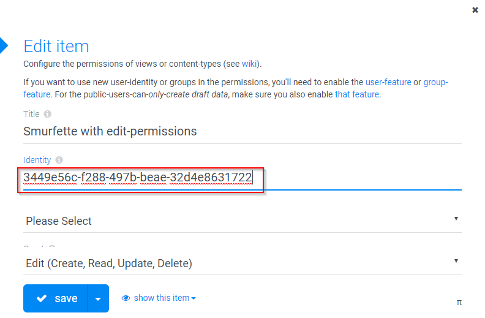

# How to setup environment for testing permissions with this app?

1. Install DNN 7.4.2 (http://2sxc-dnn742-test.dnndev.me)
1. Install 2sxc
1. Install this app in 2sxc
1. Copy DNN page templates from eg. \Portals\0\2sxc\app-dev-testing-permissions-and-save\assets\Templates to eg. \Portals\0\Templates (use real path depending on your Portal setup)
1. Create new page "app-dev-testing-permissions-and-save" using page template **app-dev-testing-permissions-and-save.page.template**
1. Enable Page Permission  "All Users" to "View Page"
1. Click on "install users and roles" link to the top of the new page
1. Remember groupId for group "Smurfs".
1. In 2sxc app config, update groupId for permissions on content type
   1. t3-content-type-Shema-C-EditDraft-D (read schema, create (full-create, not draft), edit-draft only, delete)

1. Convert dnn user SuperUser to SuperUser account.
1. Click on [Sign in Smurfette...], than copy **UserGuid**, than again Sign in as SuperUser
1. In 2sxc app config, update UserGuid for permissions on content type:
   1. t1-simple-content-type

All is ready for testing.
